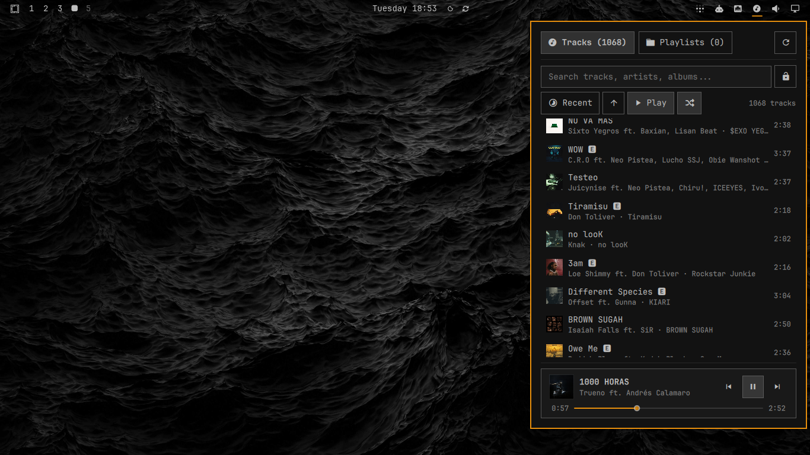

# Mixarchy

A minimalist, blazingly fast local HiRes music player for the [Omarchy](https://omarchy.org/) Linux desktop shell.

Mixarchy integrates natively into the Omarchy bar via **Quickshell** (Qt Quick / QML), backed by a lightweight, high-performance **Rust** controller and **mpv** audio engine. No Electron, no WebViews, no heavy background daemons.



---

## Features

### Audio Engine & Performance
- **Bit-Perfect HiRes Playback**: Pristine audiophile playback for FLAC, ALAC, WAV, MP3, Opus, and OGG via a hardware-optimized `mpv` engine.
- **Native Driver-Level Gapless Playback**: Preloads the next queue track directly into mpv's demuxer buffer (`loadfile append`), eliminating audio gaps, clicks, and latency for live albums and continuous sets.
- **Auto-Sleep on Pause (0.0 MB RAM)**: Hibernates the playback engine on pause or stop, freeing all memory and audio devices (**0.0 MB RAM, 0.0% CPU**) while preserving millisecond-accurate track position for instant resume.
- **Strict Buffer Tuning**: Demuxer buffers tuned to bare minimums (`--demuxer-max-bytes=2048KiB`, headless null video output) reducing active playback memory footprint to ~88–96 MB (~78% lower than Chromium web players).
- **Zero-Daemon Architecture**: No resident background services or daemons eating system resources. The Rust controller runs ephemerally on-demand and exits in ~2 ms.

### Library & Queue Management
- **Instant Search with Queue Lock (`󰌿` / `󰌾`)**: Real-time filtering across titles, artists, and albums. Decoupled queue allows playing a search result within the full library, or toggling the lock button to restrict playback strictly to the search results.
- **Deterministic Fisher-Yates Shuffle**: True randomized queue permutations that preserve reliable, bidirectional navigation (`Next` / `Prev`) without erratic jumps or duplicate repeats.
- **Multi-Criteria Sorting**: Quick sorting with ascending/descending toggle across **Artist**, **Album**, **Title**, **Duration**, or **Recent** (file modification time).
- **Automatic Playlists**: Seamlessly detects and plays `.m3u` / `.m3u8` playlists nested in your music directory with relative path resolution.
- **Rich Tag Extraction & Clean Collaborations**: Sub-second parallel metadata indexing via [Lofty](https://github.com/Serial-ATA/lofty-rs) with standardized collaboration formatting (`Artist ft. Collaborator`).

### UI & Desktop Integration
- **Native Quickshell Bar Widget**: Integrates natively into Omarchy's Wayland desktop shell, matching active desktop themes and accent colors.
- **Embedded Album Cover Art & Thumbnails**: Automatic artwork extraction with cached 96x96 thumbnails for smooth list scrolling and full-resolution cover art for the now-playing view.
- **Interactive Progress Scrub Bar**: Smooth hover scrubbing with real-time target timestamp preview and zero-flicker resume transitions.
- **Minimalist Transport Controls**: Clean, modern `[⏮  ⏯  ⏭]` playback interface.
- **Bar Widget Quick Actions**:
  - **Left-Click**: Toggle the full player popup panel.
  - **Right-Click**: Instant Play / Pause toggle directly from the bar.
- **Auditable & Zero-Setup Distribution**: 100% auditable open source repository with automated CI/CD builds via GitHub Actions. Zero Rust or Cargo installation required for end-users (auto-fetches official release binaries or compiles locally if cargo is present).
- **Scriptable CLI**: Standalone `mixarchy-ctl` command outputting deterministic single-line JSON for easy shell scripting, IPC, or keybinding integration.

---

## Configuration & Supported Formats

- **Default Music Directory**: `~/Music/` (recursively scanned up to 8 directory levels deep; cached in `~/.cache/mixarchy/library.json`).
- **Rescanning**: Click the refresh icon (`󰑐`) in the UI header or run `mixarchy-ctl scan` anytime to re-index your collection.
- **Supported Formats**:
  - **Lossless**: FLAC (`.flac`), ALAC / AAC (`.m4a`), WAV (`.wav`)
  - **Lossy**: MP3 (`.mp3`), Opus (`.opus`), OGG Vorbis (`.ogg`)
  - **Playlists**: `.m3u` and `.m3u8` (resolved relative to playlist file location)

---

## Performance

Mixarchy is engineered with a strict **zero-overhead** philosophy: no persistent backend daemons eating RAM in the background, native binary IPC, and blazingly fast disk I/O with [Lofty](https://github.com/Serial-ATA/lofty-rs).

### Real-World Latency (1,068 HiRes Audio Tracks)

| Operation | Average Latency | Min Latency | Details |
|---|---|---|---|
| **Status Check** (`mixarchy-ctl status`) | **~1.8 ms** | **1.4 ms** | Polled by Quickshell every 5s with local 200ms wall-clock interpolation. Zero CPU wakeups. |
| **Thumbnail Lookup** (`mixarchy-ctl cover --thumb <id>`) | **~5.8 ms** | **4.1 ms** | Serves cached 96x96 thumbnail path for ultra-fast list rendering. |
| **Full Cover Extraction** (`mixarchy-ctl cover <id>`) | **~12.6 ms** | **9.2 ms** | Extracts full-res artwork as base64 data URI on-demand for the now-playing view. |
| **Library Load** (1,068 tracks JSON) | **~9.9 ms** | **7.7 ms** | Instant UI populate time; well under one 60 FPS frame (16.6 ms). |
| **Full Library Scan** (1,068 files on disk) | **~163 ms** | **144 ms** | Full recursive disk traversal, metadata decoding, and cache generation. |

### Resource Comparison: Mixarchy vs. Streaming Web App

Measured on Arch Linux / Omarchy desktop:

| State | Tidal (Chromium Desktop App) | Mixarchy (Rust + mpv) | Savings |
|---|---|---|---|
| **Background + Paused** | **428.9 MB** RAM (6.2% CPU) | **0.0 MB** RAM (0.0% CPU)* | **-100%** |
| **Foreground + Paused** | **427.6 MB** RAM (5.4% CPU) | **0.0 MB** RAM (0.0% CPU)* | **-100%** |
| **Background + Playing** | **443.2 MB** RAM (5.2% CPU) | **96.3 MB** RAM (0.6% CPU) | **-78%** RAM / **-88%** CPU |
| **Foreground + Playing** | **429.6 MB** RAM (5.4% CPU) | **96.7 MB** RAM (0.7% CPU) | **-77%** RAM / **-87%** CPU |
| **Stopped** | N/A (Tidal process persists) | **0.0 MB** RAM (0.0% CPU) | **-100%** |

*\* **Auto-Sleep on Pause**: Mixarchy automatically hibernates the playback engine on pause, storing the millisecond-accurate track position in state cache and releasing the entire audio process. When resumed, it seamlessly restarts playback at the exact timestamp with zero perceptible latency.*

---

## Requirements

- **Omarchy Linux** (with Hyprland & Quickshell shell)
- **`mpv`** (required for playback):
  ```bash
  sudo pacman -S mpv
  ```

> [!NOTE]
> Mixarchy's repository contains 100% auditable source code with automated CI/CD builds via GitHub Actions. End-users do **not** need Rust or Cargo installed; `install.sh` and the Quickshell UI automatically fetch the pinned, immutable precompiled `x86_64` release binary verified against an exact SHA-256 checksum (or compile from source if `cargo` is present).

---

## Installation

### Method 1: Via Omarchy Plugin Manager (Recommended)

Run in your terminal:

```bash
omarchy plugin add https://github.com/ariasbruno/mixarchy.git --enable
```

Omarchy will automatically clone the repository into `~/.config/omarchy/plugins/ariasbruno.mixarchy/`, validate the manifest, and place the widget into your bar.

### Method 2: Manual Install (Developer / Offline)

Clone the repo outside your config, then run the installer. The installer
copies the plugin files (including the prebuilt `mixarchy-ctl` binary) into
`~/.config/omarchy/plugins/ariasbruno.mixarchy/` and registers the widget:

```bash
git clone https://github.com/ariasbruno/mixarchy.git
cd mixarchy
./install.sh
```

> [!NOTE]
> `install.sh` requires `mpv` installed. It never runs privileged commands;
> if `mpv` is missing it prints instructions and exits. The Cargo fallback
> resolves `cargo` only from fixed root-owned system locations (`/usr/bin`,
> `/bin`, `/usr/local/bin`) — never from `~/.cargo/bin` — so a
> user-writable toolchain can never be silently executed. The script copies
> files rather than symlinking, so the installed plugin is self-contained and
> survives later changes to this clone.

---

## CLI Control (`mixarchy-ctl`)

Mixarchy includes a standalone, scriptable CLI tool that outputs deterministic single-line JSON:

```bash
# Playback controls
mixarchy-ctl toggle                                # Play / Pause
mixarchy-ctl play [path] [source]                  # Play specific track or resume
mixarchy-ctl play-queue <src> <idx|random> <paths> # Play queue with source and start index
mixarchy-ctl next                                  # Next track in queue (gapless)
mixarchy-ctl prev                                  # Previous track
mixarchy-ctl shuffle                               # Toggle shuffle mode
mixarchy-ctl seek <seconds>                        # Seek to specific position (e.g. mixarchy-ctl seek 45)
mixarchy-ctl stop                                  # Stop playback and release audio

# State & Library
mixarchy-ctl status                                # Get current playback status, track metadata, and time
mixarchy-ctl library                               # Dump indexed library tracks and playlists
mixarchy-ctl scan [dir]                            # Rescan music directory (defaults to ~/Music)

# Cover Art & Thumbnails
mixarchy-ctl cover <id>                            # Extract full-res cover as base64 data URI
mixarchy-ctl cover --thumb <id>                    # Get cached 96x96 thumbnail path for track list
```

---

## Contributing & Marketplace Submission

Mixarchy is prepared for submission to the [Omarchy Community Plugin Marketplace](https://plugins.omarchy.org/).

To validate the plugin manifest locally:

```bash
omarchy plugin validate ~/.config/omarchy/plugins/ariasbruno.mixarchy
```

---

## Security & Trust Notes

- **Pinned-artifact distribution**: The precompiled `x86_64` release binary is immutable (tag `v1.1.1`, built by GitHub Actions) and every acquisition path — installer download, in-place binary, local build — is verified against its exact SHA-256 checksum before it is staged or executed.
- **Fail-closed bootstrap**: The Quickshell widget runs no command before the pinned binary is verified; a failed download or digest mismatch disables the player with a visible error instead of falling back to unverified bytes. A local `cargo` build is accepted only behind the explicit `MIXARCHY_DEV_BUILD=1` opt-in (developer mode, permanently visible warning).
- **Trusted tool resolution**: Both the widget's QML probe and `install.sh` resolve tools only from fixed root-owned system locations and validate the resolved file (regular file, root-owned, non-group/other-writable). The QML probe validates ownership of the tool file and its immediate parent directory; `install.sh` additionally validates every directory in the full chain. Neither ever consults the inherited `PATH` or `$HOME`.
- **No privileged or shell execution**: Nothing in the install or runtime path runs with elevated privileges or through a shell; every process boundary is argv-only with a cleared environment.
- **Bounded scans & queue size**: Library scans traverse at most 8 directory levels, bounding work on pathological trees. Play-queue requests travel as a single argv batch, so queues on the order of 100k tracks can exceed the kernel `ARG_MAX` limit and should be chunked.

---

## License

MIT License
